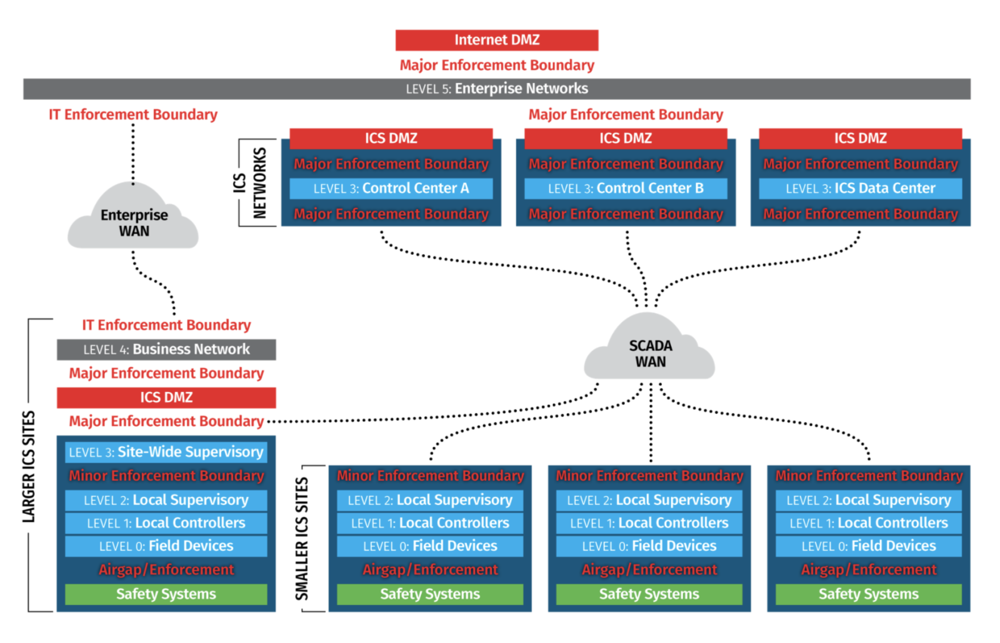

# ICS Security from a PERA Perspective

> Throughout this report, ICS security was recontextualized by breaking security concerns into individual PERA layers. Layer-by-layer countermeasures, all rooted in efficient, modular, and well-documented design ensure failure tolerance and security in our systems that cannot fail.

## Table of Contents

- [Introduction](#introduction)
- [OT and IT](#ot-and-it)
- [Enterprise Architecture](#enterprise-architecture)
- [PERA Layers & Vulnerabilities](#pera-layers)
  - [Layer 0: Physical Processes](#layer-0-physical-processes)
  - [Layer 1: Intelligent Devices](#layer-1-intelligent-devices)
  - [Layer 2: Control Systems](#layer-2-control-systems)
  - [Layer 3: Manufacturing Operations Systems](#layer-3-manufacturing-operations-systems)
  - [Layer 4: Business Logistics](#layer-4-business-logistics)
- [Alternate PERA Models](#alternate-pera-models)
- [Manufacturing Control Layers](#manufacturing-control-layers)
- [Security Across Layers](#security-across-layers)
- [Industrial Network Security](#industrial-network-security)
  - [Network Access Control](#network-access-control)
  - [Communication Protocols](#communication-protocols)
- [Conclusion](#conclusion)
- [Resources](#resources)

## Introduction

This document covers key concepts within Industrial Control Systems (ICS) security. It analyzes common frameworks and industry standards to understand enterprise design choices and security practices. Additionally, this covers security concerns for Industrial Internet-of-Things (IIoT) protocols.

The **Purdue Enterprise Reference Architecture (PERA)** is a common model used to describe the control processes within **Enterprise Architecture**. This model is a useful tool to understand the data and systems utilized within enterprises, and how enterprises work to optimize goal-metrics. Additionally, this model allows for understanding how end-users and vendors can integrate applications. 

> From a security angle, PERA helps break down individual concerns within operational technology (OT), which allows for more focused analysis of threats in ICS.

## OT and IT

### Operational Technology (OT)

Operational technology connects, monitors, and manages an enterprise's industrial operations. OT is purpose-built- modular and more specialized for specific industrial applications. It is built for reliability and availability, as OT is expected that it can run 24/7 without failure, and last a long time in not ideal conditions.

### Information Technology (IT)

Information technology connects, monitors, and manages an enterprise's business operations. Business operations involve multiple facets of information, such as HR, finances, and emails. IT is made to be replaceable after a few years and typically runs off-the-shelf products such as Windows.

### IT/OT Convergence

A modern trend we are seeing more commonly in enterprises is that IT data can alter OT decisions, and vice-versa. The cross-over between these two scopes is **IT/OT convergence**, and it comes with major advantages and significant security concerns. For example, if an enterprise is getting less orders, it can reduce the quantity manufacturing sites produce- quickly and mostly automated via IT/OT convergence. A large amount of modern exploits targeting ICS starts via IT channels, and propagate into OT, which emphasizes the importance of proper isolation and enforcement boundaries.

## Enterprise Architecture

Enterprise Architecture (EA) is concerned with the behaviors of a business in processes and roles that create and use business data.

**For example**, imagine that there is a paper-selling office located in Scranton. One day, this office has a safety training session,
and one of the employees starts a fire and destroys the CPR dummy. Financial expenditures, delay in shipping and sales,
and reductions on employee utilization would concern EA.

EA has a primary goal of developing practices and creating well-defined frameworks in how a business makes decisions.
Primarily, enterprises use these structures to execute its strategies by adjusting how it uses business capabilities, information, process,
and technology. EA's primary scope is within IT design, ecosystem adaptation, and integration.

By maintaining EA, this allows technology-related decision-making to be standardized- which reduces complexity, allows for consolidation,
reduces system failures, and improves connectivity between systems. Other techniques/strategies can be used to maintain enterprise technology,
though similar procedures generally chase same goals that EA attempts to achieve.

## PERA Layers

PERA is divided into **5 layers**, with layers 0-2 being grouped into one layer as **real-time control**, as they are all involved with physical processes.

*Source: "Purdue Enterprise Resource Architecture". Wikipedia.com.*

### Layer 0: Physical Processes

#### Description

This is the actual materials and non-programmable/passive devices. **Physical processes are conducted by passive devices
onto manufacturing materials**. Pretty straightforward.

#### Vulnerabilities

This is the simplest layer in terms of vulnerabilities, as nearly everything is physical.

- **Supply-Chain Trust** - Availability/Integrity - Are the materials and machines being acquired trustworthy and high-quality?
- **Unauthorized Access/Espionage** - Integrity/Confidentiality - Are individuals with access to the manufacturing floors authorized and trustable?
- **Physical Sabotage** - Availability/Integrity - Can the physical processes be manipulated to do unintended things?
- **Environmental Exposure** - Availability - Is the plant/manufacturing site secure against environmental disasters?
    - This includes power outages.
- **Effective Physical Processes** - Availability - Is the plant/manufacturing site designed well?
- **Process Degradation** - Integrity - Is machinery up-to-date and functioning optimally?

#### Examples

1. **Toyota Accelerator Pedal Recall (2010)** - Toyota had to recall 8.5 million vehicles due to defective accelerator pedals supplied by a third-party vendor. This is a failure in supply-chain trust that violated availability.
2. **Coca-Cola Trade Secret Theft (2018)** - Three employees were stealing trade secrets from Coca-Cola with the intent to sell information to a competitor. This is unauthorized access that violated integrity.
3. **Australian Federal Police v. NTC Company (2010)** - NTC Company discovered that a long term employee at their industrial chemical plant was adding foreign substances to chemicals, which caused products to fail quality control. This is physical sabotage that violated availability.

#### Mitigations

- **Ensuring effective floor design and management** are key in building reliable ICS systems. For example, OSHA compliance and having backup power mitigate ineffective physical processes, environmental exposure, and process degradation.
- **Maintaining legal compliance and good supplier relationship management (SRM)** can prevent failures in supply-chain trust.
- **Ensuring proper manufacturing site security** can prevent unauthorized access and espionage.
- **Maintaining effective human resources** can prevent unauthorized access and espionage.

Though these mitigations require higher levels of managerial insight and documentation in industrial design and planning, a majority of these mitigations pay off beyond just protecting against vulnerabilities, and can ensure repeatability and understanding of what resources are being utilized. Additionally, these mitigations allow for the enterprise to follow legal compliance and prevent availability issues. 

The most difficult one to implement would be within human resources- as oftentimes motivations for espionage are financial. That implies a human resources mitigations could include increasing payroll and benefits, which often is not feasible for enterprises. Other human resources improvements could be in improved conflict resolution and employee happiness, but the human factor is never fully controllable.

### Layer 1: Intelligent Devices

#### Description

**Intelligent electronic devices (IEDs) sense and manipulate the physical processes in Layer 0**. This is where we get sensors, actuators, Remote Terminal Units (RTUs), Programmable Logic Controllers (PLCs), Computer Numerical Control (CNC), and Programmable Automation Controllers (PACs)- networked or hard-wired. In industrial systems, it is necessary that these devices work fast and reliably to keep up with the demands of production for as long as possible. 

With intelligent devices, if sensors and actuators are not directly networked and/or connected to supervisory control, RTUs and controllers can act as the "middleware" to connect sensors and actuators to supervisory control.

Since IEDs are typically custom built to fit manufacturing needs and are often not designed to be replaced, regularly updating them is often not feasible- which exposes these devices to vulnerabilities that don't get frequently patched.

#### Vulnerabilities

- **Supply-Chain Trust** - Availability/Integrity/Confidentiality - Are the OT devices trustworthy and high-quality?
  - This also can include OT devices being used on production floors despite them having known vulnerabilities.
  - Another important note here is failure tolerance. OT devices should be very reliable.
- **Unauthorized Access/Espionage** - Integrity/Confidentiality - Are individuals with access to the manufacturing floors authorized and trustable?
- **Side-Channel Attacks** - Integrity/Confidentiality - Are side-channels (power usage, EM emissions, etc.) revealing sensitive information about operation?
- **Insecure Protocols** - Integrity/Confidentiality - Are SCADA protocols being used that don't have encryption and authentication?
- **Device Hijacking** - Availability/Integrity - Are the OT devices vulnerable to exploits that can disrupt processes?
  - This includes outdated firmware vulnerabilities or hardware attacks from exposed JTAG ports.

#### Examples

1. **Triton Malware (2017)** - When russian attackers were able to gain access into an enterprise, they would utilize lateral movement over IT and OT systems to target a vulnerability in Schneider Electronic Triconex safety instrumented system (SIS), which were the devices used to initiate shutdown protocols during emergencies. Trition allowed for complete remote control over the SIS. This is unauthorized access and device hijacking that violates availability and integrity.
2. **Stuxnet Worm (2010)** - The infamous "first" ICS attack was created by Israel and the US, and targeted the Natanz Nuclear Facility in Iran. It was introduced via USB flash drive, where it would infect Windows machines and expand laterally across networks. It utilizes malicious SQL commands and targets PLCs running Siemens Step7 software. Once Step7 software was detected, the rootkit would be installed and it would manipulate the PLC inputs and outputs and alters logs to reduce detectability. In the Natanz Nuclear Facility, it sped up gas-centrifuges fast enough to break them. This is unauthorized access, physical sabotage, supply-chain trust, and device hijacking that violates availability and integrity.

#### Mitigations

In conjunction with the Layer 0 mitigations, the following mitigations can prevent exploits to intelligent devices:

- **Regular audits of who has access to devices** can prevent unauthorized access and espionage.
- **"Locking" devices that should not be frequently programmed, and triggering alarms if they are programmed** can prevent device hijacking.
- **Air-gapping or isolating important intelligent devices** - whether it's geographically, with different networks, or with Faraday cages- can prevent leakage in side channels and unauthorized access.
- **Disable unused ports and services** on devices to prevent device hijacking.
- **Systems should be designed to include security features** in order to ensure secure protocols and prevent unauthorized access.
- **Mobile data exchange with isolated networks should be scanned for anything malicious** in order to ensure supply-chain trust and prevent device hijacking.

Production floor security should be expected, and locking devices that aren't commonly programmed is a simple workaround. On the other hand, the other mitigations can have significant tradeoffs for enterprises. 

Isolating intelligent devices, and verifying everything that crosses that boundary, can be resource intensive. Security checks take time, labor, and money. Machine learning speeds up these processes, but still requires specialized labor to integrate security into ICS trust boundaries. 

There is typically a massive amount of intelligent devices within ICS, so adding security features requires significant oversight and device management. Implementing feasible ways to add security updates (such as OTA updates) can introduce new attack surfaces.

### Layer 2: Control Systems

#### Description

This is the fun part- we get to start putting the hardware into software. Control systems are the real-time control that leverages intelligent devices to alter physical processes. It supervises, monitors, and controls industrial processes. At this point we get **Human Machine Interfacing (HMI)**, where physical displays visualize and control data in ICS.

An important concept in control systems is **Distributed Control Systems (DCS)**. This is control that is geographically distributed across processes and interfaces with controllers and networks. The goals of DCS are as follows:
1. Convey different control capacities onto subsystems by rapidly transporting correspondences.
2. Computerize industrial processes by coordinating control techniques.
3. Organize the entire industrial process as a system.

Last but not least, we get the Queen of ICS- **Supervisory Control and Data Acquisition (SCADA)** software. SCADA controls machines and processes with high level computerized systems. It's essentially a DCS, but larger scale and typically less specialized in terms of the software provided. It handles real-time control logic via setpoint changes, monitoring, and setting process commands.

#### Vulnerabilities

- **Insecure Protocols** – Integrity/Confidentiality - Are SCADA protocols being used that don't have encryption and authentication?
- **Network Security** - Integrity/Confidentiality - Are networks isolated, contain firewalls, and fragmented for sensitive areas?
- **System Configuration Consistency** - Availability/Integrity - Are systems documented and configured within specified parameters, and will unauthorized changes outside the parameters detected?
- **Unauthorized Access/Espionage** - Integrity/Confidentiality - Are individuals with access to the control software authorized and trustable?
- **Supply-Chain Trust** - Availability/Confidentiality - Is control system software reliable, consistently updated and following proper security standards?
- **Failure Tolerance** - Availability - If a control system is compromised, are there repair processes, procedures, alarms, and backups available?
- **Configuration Errors/Control Logic Manipulation** - Integrity/Availability - Are control parameters misconfiguration in a way that could result in incorrect operation?
- **Patch Management Deficiency** - Availability/Integrity - Is software and firmware regularly updated- and is there auditing and regulations on managing updates?
- **Poor Auditing/Logging** - Integrity/Non-Repudiation - If an attacker was to gain access, could they be detected through control system alarming and logging?

#### Examples

1. **United States v. Martin K. Maxwell (2005)** - Maxell was fired from a manufacturing plant, and in retaliation he hacked into the plant's SCADA systems to delay production lines. This is unauthorized access and control logic manipulation that violated integrity and availability.
2. 

#### Mitigations

In conjunction with the mitigations listed for Layer 1 and Layer 0, the following mitigations help to secure control systems:

- **Properly configured Security Information and Event Management (SIEM)** can prevent poor auditing and logging.
- **Whitelisting applications for HMI** can prevent unauthorized access and supply-chain compromise by reducing the amount of applications that have access to systems.
- **Testing updates, new features, and patches before deploying** can prevent any update failures.
- **Documenting expected usage and configurations, and alarming any unusual settings** can prevent control logic manipulation.
- **Security features should be consistently updated and sought after** in order to ensure secure protocols, secure networks, and prevent unauthorized access.

As with Layer 1, implementing SIEM, building whitelists, adding updates, and testing features are all time intensive procedures. While testing features before deployment is just good practice and ensures availability, the others are more exclusive to security and would require extra labor and money.

### Layer 3: Manufacturing Operations Systems

#### Description

Manufacturing operations systems are the **middleware between enterprise control and industrial supervisory control**. Its goals are to manage production workflows, organize data, and assure production reliability.

Manufacturing operation systems rely on different tools and concepts to efficiently maintain data flows between OT systems and IT systems by collecting operations intelligence via integrating data sources to determine Key Performance Indicators (KPIs) and alarming systems. Oftentimes manufacturing operations systems will be integrated within either Layer 2 or Layer 4 software to reduce technical oversight, though dedicated software can be found for individual operations. 

Here are a few of the important manufacturing operation system concepts:

- **Batch Management** keeps track of each individual production batch. It traces each batch and evaluates quality, resource allocation, and stocking accuracy. When ICS produces in batches, getting real-time input on the effectiveness of production becomes incredibly useful in tracking software.
- **Manufacturing Operations Management Systems (MOMS)** are systems that manage end-to-end production. They manage quality, compliance, production management, performance, and use HMI systems for supervisory control.
- **Manufacturing Execution Systems (MES)** document the process of how raw materials become finished goods and can do real time monitoring of production elements. Whereas MOMS are focused on KPI optimization, MES is more focused on alarming and control.
- **Historian Software** is quite important. It is the time-series databasing that keeps track of supervisory control. It's goal is to centralize data to be accessible via APIs, SDKs, and SQL. It collects, organizes, and labels data while conducting limit monitoring for alarming and validation. It also will aggregate and interpolate data and can allow for manual data entry.

#### Vulnerabilities

- **Data Corruption** - Availability/Integrity - Is important data accurate, and recoverable from an isolated environment?
- **Database Leaks** - Confidentiality - Is the cloud and database services properly configured?
  - This includes SQLI or other API interfacing flaws.
- **Network Security** - Integrity/Confidentiality - Are network boundaries properly enforced?
- **Unauthorized Access/Espionage** - Integrity/Confidentiality - Are individuals with access to the manufacturing software authorized and trustable?
- **Supply-Chain Trust** - Availability/Confidentiality - Is manufacturing software reliable, consistently updated and following proper security standards?
- **Failure Tolerance** - Availability - If manufacturing operating systems fail, is there defaults and backup settings in place?
- **Configuration Errors** - Integrity/Availability - Are MES/MOMS misconfiguration in a way that could result in incorrect operation?
- **Patch Management Deficiency** - Availability/Integrity - Is software and firmware regularly updated- and is there auditing and regulations on managing updates?
- **Poor Auditing/Logging** - Integrity/Non-Repudiation - If an attacker was to gain access, could they be detected through control system alarming and logging?

#### Examples

1. 

#### Mitigations

SIEM, audits, alarms, whitelists, testing, and adding security features as described above are also important for this layer. Here's some additional mitigations:

- **Data validity verification (such as checksums) and secure backups** prevent data corruption in manufacturing operating systems.
- **Firewalls and IP geo-blocking** prevents unauthorized access and ensures network security.
- **Implementing jump servers to enforce boundaries** ensures network security.
- **Choosing secure protocols with authentication and encryption** prevents insecure protocols.
- **Intrusion Detection Systems (IDS) can be used see if anything crossed the IT/OT trust boundary, or has appeared in OT systems,** which prevents unauthorized access.

> **Note:** Implementing machine learning (ML) into IDSs can be useful. There are two major types of ML: supervised and unsupervised. Supervised models are previously trained on labeled data, and they are effective in detecting known anomalies. Unsupervised learning allows for ML modules to detect unique anomalies without organizing and labeling data. It does this by detecting events and finding patterns in the events, then setting a boundary as to what benign and malicious patterns are.

### Layer 4: Business Logistics

#### Description

Business logistics is all about how a business is using its resources. The decisions made in business logistics occur over the 
scale of years, months, and weeks. This layer is super cool because it **converges Operation Technology (OT) with Information Technology (IT)**. 
Business logistics essentially looks to maximize industrial operation efficiency by using enterprise information.

Typically, business logistics use **Enterprise Resource Planning (ERP)**,
or something similar. ERP is a model that organizes material use, shipping & inventory, and the basic plant production schedule-
all while planning to meet future business objectives.

ERP leverages business management software- typically cloud-based. It continuously updates core business processes in real-time
using database management systems. It tracks cash, materials, production capacities, orders, purchases, and payroll. ERP applications
can share data across varying departments and manage connections with external stakeholders.

*Source: "Enterprise Resource Planning". Wikipedia.com.*

Business logistic concerns are grouped into modules following ERP. A few ERP modules are as follows:

- **Sales** - pricing, sales analysis and reporting, and order entry
- **Project Management** - project planning, project costing, time and expense, performance and activity, and resource planning
- **Financial accounting** - ledger, assets, payment, cash management, and financial consolidation
- **Management accounting** - budgeting, cost management, billing, and invoicing
- **Product Lifecycle Management (PLM)** - engineering, bill of materials, work orders, scheduling, capacity, quality control, and manufacturing process
- **Supply Chain Management (SCM)** - supply chain planning, supplier scheduling, purchasing, inventory, and warehousing
- **Human Resources (HR)** - recruiting, training, payroll, benefits, retirement, diversity, and separation.
- **Customer Relationship Management (CRM)** - sales, marketing, commissions, service, customer contact, and call center support
- **Supplier Relationship Management (SRM)** - suppliers, orders, and payments

#### Connections to other Layers

Business logistics is unique in PERA as it seems quite removed from the actual OT aspect of an ICS. But, the logistics of the business 
have direct effect on the decisions made within plants/factories. Additionally, ERP system software is still very much is an operational control system- 
just with primarily human and financial resources instead of material and hardware resources.

With that being said, ERP systems vary in how integrated they are with lower levels of PERA. It depends on ERP systems, but there are 3 main integration types:

- **Direct Integration** - This can only occur if a vendor for ERP software offers specific support for plant floor equipment. This connects Layer 4 directly to the other layers of PERA, therefore meaning ERP systems can have built-in software that we see in Layer 3.
- **Database Integration** - ERP systems connect to plant floor data sources through staging tables in databases. This connects Layer 4 directly to Layer 3.
- **Enterprise Appliance Transaction Modules (EATM)** - EATM directly talks to both plant floor equipment and ERP systems. In this case, EATM plays the role of Layer 3.

#### Vulnerabilities

As ERP has the most pieces to it, and the most user interaction, vulnerabilities in Layer 4 are both very expansive and have severe implications. If business logic is exploited, the malicious decisions ERP workflows make will seep into the lower layers of production.

- **Phishing/Social Engineering** - Confidentiality - Are the employees able to be tricked into exposing credentials, downloading malware, or doing unauthorized ERP workflows?
- **Database Leaks** - Confidentiality - Is the cloud and database services properly configured?
- **Unauthorized Access/Espionage** - Integrity/Confidentiality - Are individuals with access to ERP software, communication, and financial accounts authorized and trustable?
- **Supply-Chain Trust** - Availability/Integrity/Confidentiality - Is the ERP software trustable, up-to-date, only given necessary information, and following proper security standards?
  - This includes plug-ins, apps, and any other software integration that any sensitive data is given to.
- **Data Corruption/Sync & Backup Errors** - Availability/Integrity - Is important data accurate, and recoverable from an isolated environment?
  - If backups are not isolated in the case of ransomware attacks, all data is will be encrypted by the attack.
  - Misleading data can totally alter the decisions made by ERP software.
- **Privilege Escalation/Mismanaged Roles** - Integrity/Confidentiality - Is there a proper Separation of Duties (SoD) and are user's permissions consistently being cleaned up?
  - If an attacker has proper privileges, they can abuse business logic for their own goals.
- **Poor Auditing/Logging** - Integrity/Non-Repudiation - If an attacker was to gain access, would they be detected through audits of ERP logs?
- **Executive Decision Attacks** - Integrity - Can an attacker alter ERP data to manipulate automated and human decided executive decisions?

#### Examples

1. **Colonial Pipeline Ransomware Attack (2021)** - Using Colonial Pipeline's inactive virtual private network (VPN) account with an exposed password, hackers were able to gain remote access to their computer systems and encrypt it with ransomware. The ransomware targeting billing and financial systems, but without orders Colonial Pipeline could not conduct pipeline operations. Colonial Pipeline had to pay 4.4 million USD to return to operations. This was a failure in supply-chain trust (VPN account exposure), poor auditing, and proper backup creation that resulted in a violation of availability and integrity.
2. **Ukrainian Power Grid Trojan (2015)** - Utilizing social engineering campaigns, Russia's Sandworm Team was able to infect Ukranian Power Grid enterprise computers with the DoS BlackEnergy trojan via Microsoft Word's macros settings. This trojan disconnected the infected computers with the control system by blocking control and reporting messages, gained lateral movement through user accounts and network information, and exfiltrated data. A Killdisk was delivered to devices necessary to system recovery, which wiped their OS and render them unbootable. Through social engineering, data corruption, unauthorized access, and privilege escalation confidentiality, integrity, and availability were violated.

#### Mitigations

This layer is more IT focused, so mitigations will look a bit different. Overlapping mitigations include SIEM, IDS, implementing & testing security features, and secure network strategies.

- **Activity with external facing business activities should be checked for early stage reconnaissance activity** to prevent phishing and unauthorized access.
- **Checking supply-chain metadata to ensure legitimate ICS software is being utilized** can prevent faliures in supply-chain trust.
- **Providing security training to employees** prevents social engineering attacks and unauthorized access.
- **Clearly separating privileges (SoD) within ERP** can stop privilege escalation.
- **Isolating the backup server** can prevent data corruption.
- **Auditing accounts and software that contains privileges or sensitive information** can prevent privilige escalation and database leaks.

## Alternate PERA Models

Another model I saw floating around was more focused on modern information flow with cloud based ICS, and is from the SANS ICS410 reference. It is structured as follows:

| Purdue Layer | Description | Examples |
| :--- | :--- | :--- |
| Layer 5: Enterprise Networks | Corporate level services that assist  business divisions and individual users.  Typically located in company data centers. | <ul><li>Active Directory (AD)</li><li>Internal Emails</li><li>Corporate Billing</li><li>Real-Time Backup</li></ul> |
| Layer 4: Business Networks | IT networks specifically tailored for  business users. They provide the enterprise's  wide area network (WAN). | <ul><li>IT Workstations</li><li>Phone Systems</li><li>Backup AD</li><li>File & Print Servers</li></ul> |
| IT/OT Boundary | | |
| Layer 3: Site-Wide Supervisory | Software that monitors, supervises, and provides  operatoinal support for all company regions. | <ul><li>Engineering Workstations</li><li>HMIs</li><li>Data lake systems for analytics</li><li>Historians</li></ul> |
| Layer 2: Local Supervisory | Observation and managerial oversight  for processes. | <ul><li>HMIs</li><li>Historians</li><li>Local Control Room</li></ul> |
| Layer 1: Local Controllers | Systems designed to automate  process regulation. | <ul><li>PLCs</li><li>RTUs</li><li>Control processors</li></ul> |
| Layer 0: Field Devices | Sensors and actuators that  are used on the plant floor. | <ul><li>IEDs</li><li>IIoT Devices</li><li>Communication Gateways</li><li>Sensors & Actuators</li></ul> |

*Source: Pelaez, Manuel Humberto Santander. "Controlling network access to ICS systems". SANS Technology Institute Research Review Journal Diaries, 2023.*

An important distinction with this model is that logic controllers (RTUs, PLCs, etc.) are distinct from field level control in intelligent/IIoT devices.

I like this distinction, as IIoT devices and logic controllers have different concerns can be handled differently by SCADA systems. Modern control systems are trending towards integrating Levels 0 and 1 more comprehensively, but the older ones are out there and important to consider. 

As this model is more focused on separating sites and networks, Layer 3 and Layer 2 are a separated version of the control systems layer in our model above. This helps to emphasize different enforcement boundaries.  It also does not exactly have the manufacturing operations system layer we discussed- it seems as if that in included into supervisory control. Additionally, the business logistics layer is separated by different concerns with this models Layer 4 and Layer 5. 

If anything, with these variation in the PERA model, I would also add a "Layer -1" to include the field itself. While it's not relevant for Pelaez's network access article, as we saw above there are important security concerns when it comes to passive devices and materials in ICS.

## Manufacturing Control Layers

As we can see here, the effective layers of control in industrial systems also has 5 main layers. The 5 layers are not a coincidence, as each **level of control coincides with each layer of the PERA model**. Lets take a closer look:

0. **Field Level** - Physical Process - This is the plant, or a control block with an input and output. Raw materials go in, something happens to it, and something comes out of the plant.
1. **Direct Control** - Intelligent Devices - This is where we get logic controllers, which directly affect the materials in the plant, based on input from supervisory control and the plant's output.
2. **Plant Supervisory** - Control Systems - Supervisory computers use SCADA software and HMI to program and alter the decisions OT devices make within the system.
3. **Production Control** - Manufacturing Operating Systems - The coordinating computer works as an in-between to reliably get usable data to the computer center, and adapt the computer center's decisions for the specialized industrial systems.
4. **Production Scheduling** - Business Logistics - The computer center takes all the data from manufacturing and utilizes business information to make overarching decisions about the entire industrial system.

## Security Across Layers

Now that we've seen each independent layer, how do they all interact with each other? 

As we saw with mitigations offered in each layer, oftentimes those mitigations would also be effective in securing other layers. At the end of the day, if even one layer of an ICS is exposed, the entire system is exposed. Take for example executive decision attacks- if someone gains access to manufacturing operation systems and alters the database information, the ERP system will take those altered KPIs and make misinformed decisions that are dangerous for the business. 

Lastly, here are security practices that secure all the layers:
- **Complying with security standards, such as IEC 62443 and relevant CIP standards** can prevent a broad amount cyberattacks against an ICS. The standards outlined in these documents are targeted and comprehensive, and are often legally enforced.
- **Regular pentesting/red-teaming ICS systems** can discover vulnurabilities before attackers do, which gives an enterprise the chance to mitigate before being required to resort to incident response.
- **Building incident response plans and preparing for failure** can prevent losses in availability in the case of attacks, and ensure cyberattacks are recoverable if they occur.
- **Designing systems to integrate security features, having documented processes, and providing effective project lifecycles** makes adopting new security features easier for an ICS.

These take security teams and a lot of resources- but that's why cybersecurity is a growing field. Enterprises simply have to plan and budget for security. There are always assets that hackers will try to obtain, which drives innovation that prevents and responds to attacks.

## Industrial Network Security

### Network Access Control

An important part of network security is controlling who has access to what. In modern ICS ecosystems, this is a unique challenge, as IT/OT convergence allows for OT to be interacted with via IT channels. Below is a neat diagram showing the typical layout of enterprises within cloud-based systems:

*Source: SANS*

### Communication Protocols

## Conclusion

Throughout this report, ICS security was recontextualized by breaking security concerns into individual PERA layers. While enforcement boundaries are necessary to secure an ICS, it is not the sole solution. Layer-by-layer countermeasures, all rooted in efficient, modular, and well-documented design ensure failure tolerance and adaptability in our systems that cannot fail.

There are a lot of vulnerabilities and mitigations across all layers of ICS, each with different costs and benefits. An important thing to consider when discussing the costs of implementing security features is that total failure of an ICS is catastrophic. Supply-chain attacks, fraud, and ransomware are common and have resulted in enterprises losing millions of dollars- and, in some cases, has even killed some enterprises. 

With that in mind, it might seem logical that mitigations should be implemented, regardless of cost. A lot are. But not all. Many factories have been around for a long time, and in the pre-Stuxnet era of ICS, most people didn't really think of control systems as a realistic target for hackers. Of course, ICS holds some of the most valuable assets for attackers, so enterprises have repeatedly been proven wrong in thinking their security measures were adequate. And this isn't an issue enterprises can fix overnight- enterprises are massive and not designed to restructure at the speed that exploits emerge.

Fundamentally, OT is designed for longevity and reliablility, while exploits can appear nearly instantaneously. Combine that with the public attention industries attack and the large amount of attack vectors, and it's a recipe for disaster. Newer enterprises often design with security in mind, making it easier to implement new mitigations, but older enterprises are constantly stuck retrofitting systems never meant to be redesigned for modern security demands. Ultimately, by being aware of design flaws and vulnerabilities, we can further document effective Industrial Control Systems and design for a better future.

## Resources

- *CIP-003-8* & *CIP-005-7*. NERC.
- FBI Cyber Division. "Triton Malware Remains Threat to Global Critical Infrastructure Industrial Control Systems (ICS)". FBI, 2022.
- MITRE ATT&CK Framework.
- Nankya, Mary, et al. "Securing Industrial Control Systems: Components, Cyber Threats, and Machine Learning-Driven Defense Strategies". MDPI, 2023.
- NIST JTF. "Security and Privacy Controls for Information Systems and Organizations". NIST SP 800-53 Rev. 5
- Souffer, Keith, et al. "Guide to Operational Technology (OT) Security". NIST SP 800-82 Rev. 3
- NSA. "Operational Technology Assurance Partnership: Smart Controller Security within National Security Systems". NSA, 2025.
- Shostack, Adam. *Threat Modeling: Designing for Security*. John Wiley & Sons, 2014.
- Wikipedia.com.
