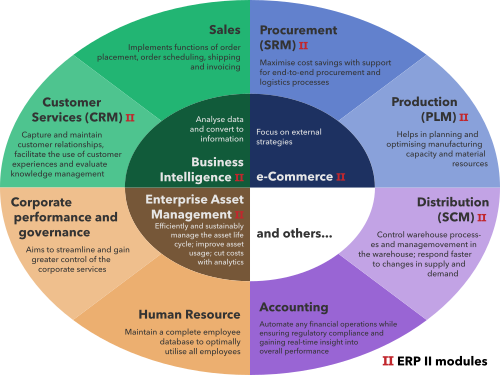
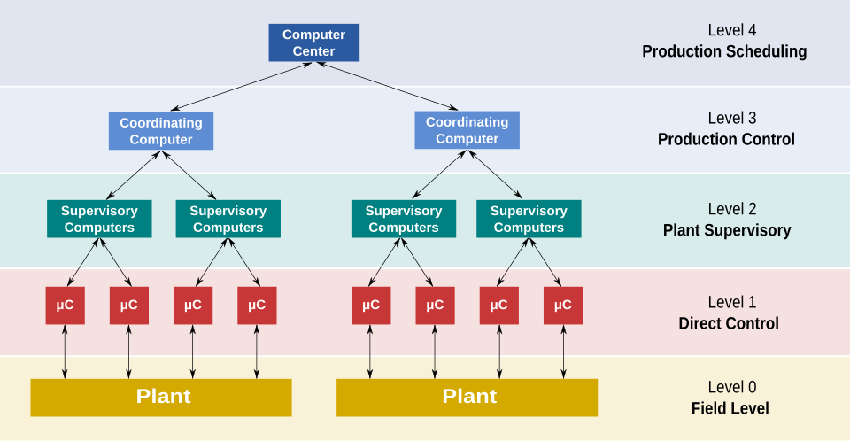

# Purdue Enterprise Reference Architecture (PERA)

> This high-level report focuses on understanding PERA, IT/OT, breaking down related tools used within EA,
> industrial control levels, and analyzing the cybersecurity implications of said topics.

## Table of Contents

- [Introduction](#introduction)
- [Enterprise Architecture](#enterprise-architecture)
- [PERA Layers & Vulnerabilities](#pera-layers)
  - [Layer 0: Physical Processes](#layer-0-physical-processes)
  - [Layer 1: Intelligent Devices](#layer-1-intelligent-devices)
  - [Layer 2: Control Systems](#layer-2-control-systems)
  - [Layer 3: Manufacturing Operations Systems](#layer-3-manufacturing-operations-systems)
  - [Layer 4: Business Logistics](#layer-4-business-logistics)
- [Manufacturing Control Levels](#manufacturing-control-levels)
- [Security Implications](#security-implications)
- [Conclusion](#conclusion)

## Introduction

- The **Purdue Enterprise Reference Architecture** is a common model used to describe the control processes within **Enterprise Architecture**. This model is a useful tool to understand the data and systems utilized within enterprises, and how enterprises work to optimize goal-metrics. Additionally, this model allows for understanding how end-users and vendors can integrate applications. 
- From a security angle, it helps to break down the different attack vectors within industrial control systems (ICS) and operational technology (OT) by separating concerns into PERA layers.

## Enterprise Architecture

Enterprise Architecture (EA) is concerned with the behaviors of a business in processes and roles that create and use business data.

**For example**, imagine that there is a paper-selling office located in Scranton. One day, this office has a safety training,
and one of the employees starts a fire and destroys the CPR dummy.

***The following would concern EA:***
- Financial expenditures of any damages
- Delay in shipping and sales
- Reductions on employee utilization

***The following would not concern EA:***
- A cat was thrown into the ceiling
- The CPR dummy's face and imaginary organs were removed
- This event resulted in a roasting session of the office branch's boss

EA has a primary goal of developing practices and creating well-defined decisions in how a business makes decisions.
Primarily, enterprises use these structures to execute its strategies by adjusting how it uses business capabilities, information, process,
and technology. EA's primary scope is within IT design, ecosystem adaptation, and integration.

By maintaining EA, this allows technology-related decision-making to be standardized- which reduces complexity, allows for consolidation,
reduces system failures, and improves connectivity between systems. Other techniques/strategies can be used to maintain enterprise technology,
though similar procedures generally chase same goals that EA attempts to achieve.

## PERA Layers

PERA is divided into **5 layers**, with layers 0-2 being grouped into one layer as **real-time control**, as they are all involved with physical processes.

### Layer 0: Physical Processes

#### Description

This is the actual materials and non-programmable/passive devices. Physical processes are conducted by passive devices
onto manufacturing materials. Pretty straightforward.

#### Vulnerabilities

This is the simplest layer in terms of vulnerabilities, as nearly everything is physical.

- **Supply-Chain Trust** - Availability/Integrity - Are the materials and machines being acquired trustworthy and high-quality?
- **Unauthorized Access/Espionage** - Integrity/Confidentiality - Are individuals with access to the manufacturing floors authorized and trustable?
- **Physical Sabotage** - Availability/Integrity - Can the physical processes be manipulated to do unintended things?
- **Environmental Exposure** - Availability - Is the plant/manufacturing site secure against environmental disasters?
- **Effective Physical Processes** - Availability - Is the plant/manufacturing site designed well?
- **Process Degradation** - Integrity - Is machinery up-to-date and functioning optimally?

#### Examples

1. **Toyota Accelerator Pedal Recall (2010)** - Toyota had to recall 8.5 million vehicles due to defective accelerator pedals supplied by a third-party vendor. This is a faliure in supply-chain trust that violated availability.
2. **Coca-Cola Trade Secret Theft (2018)** - Three employees were stealing trade secrets from Coca-Cola with the intent to sell information to a competitor. This is unauthorized access that violated integrity.
3. **Australian Federal Police v. NTC Company (2010)** - NTC Company discovered that a long term employee at their industrial chemical plant was adding foreign substances to chemicals, which caused products to fail quality control. This is physical sabotage that violated availability.

#### Mitigations

- **Ensuring effective floor design and management** can prevent environmental exposure, ineffective physical processes, and process degredation.
- **Maintaining legal complicance and good supplier relationship management (SRM)** can prevent faliures in supply-chain trust.
- ***Ensuring proper manufacturing site security** can prevent unauthorized access and espionage.
- **Maintaining effective human resources** can prevent unauthorized access and espionage.

### Layer 1: Intelligent Devices

#### Description

Intelligent devices sense and manipulate the physical processes in Layer 0. This is where we get sensors, actuators, Programmable Logic Controllers (PLCs), Computer Numerical Control (CNC), and Programmable Automation Controllers (PACs)- networked or hard-wired. In industrial systems, it is necessary that these devices work fast and reliably to keep up with the demands of production for as long as possible. 

- Since intelligent OT devices are typically custom built to fit manufacuturing needs and are often not designed to be replaced, regularly updating them is often not feasible- which exposes these devices to vulnerabilities that don't get frequently patched.

#### Vulnerabilities

- **Supply-Chain Trust** - Availability/Integrity/Confidentiality - Are the OT devices trustworthy and high-quality?
  - This also can include OT devices being used on production floors despite them having known vulnerabilities.
- **Unauthorized Access/Espionage** - Integrity/Confidentiality - Are individuals with access to the manufacturing floors authorized and trustable?
- **Side-Channel Attacks** - Integrity/Confidentiality - Are side-channels (power usage, EM emissions) revealing sensitive information about operation?
- **Insecure Protocols** - Integrity/Confidentiality - Are SCADA protocols being used that don't have encryption and authentication?
- **Device Hijacking** - Availability/Integrity - Are the OT devices vulnurable to exploits that can disrupt processes?
  - This includes outdated firmware vulnerabilities or hardware attacks.

#### Examples

1. **Trition Malware (2017)** - When russian attackers were able to gain access into an enterprise, they would utilize lateral movement over IT and OT systems to target a vulnerability in Schneider Electronic Triconex safety instrumented system (SIS), which were the devices used to initiate shutdown protocols during emergencies. Trition allowed for complete remote control over the SIS. This is unauthorized access and device hijacking that violtaes availability and integrity.
2. 
3.

#### Mitigations

### Layer 2: Control Systems

#### Description

#### Vulnerabilities

- **Insecure Protocols** – Integrity/Confidentiality - Are SCADA protocols being used that don't have encryption and authentication?
- **Unauthorized Access/Espionage** - Integrity/Confidentiality - Are individuals with access to the manufacturing floors authorized and trustable?
- **Configuration Errors/Control Logic Manipulation** - Integrity/Availability - Are control parameters misconfigured in a way that could result in incorrect operation?
- **Patch Management Deficiency** - Availability/Integrity: Industrial control software often remains unpatched for years.

#### Examples

1. **United States v. Martin K. Maxwell (2005)** - Maxell was fired from a manufacturing plant,and in retaliation he hacked into the plant's SCADA systems to delay production lines. This is unauthorized access and control logic manipulation that violated integrity and availability.
2. 

#### Mitigations

### Layer 3: Manufacturing Operations Systems

#### Description

#### Vulnerabilities

#### Examples

#### Mitigations

### Layer 4: Business Logistics

#### Description

Business logistics is all about how a business is using its resources. The decisions made in business logistics occur over the 
scale of years, months, and weeks. This layer is super cool because it **converges Operation Technology (OT) with Information Technology (IT)**. 
Business logistsics essentially looks to maximize industrial operation efficiency by using enterprise information.

Typically, business logistics use **Enterprise Resource Planning (ERP)**,
or something similar. ERP is a model that organizes material use, shipping & inventory, and the basic plant production schedule-
all while planning to meet future business objectives.

ERP leverages business management software- typically cloud-based. It continuously updates core business processes in real-time
using database management systems. It tracks cash, materials, production capacities, orders, purchases, and payroll. ERP applications
can share data across varying departments and manage connections with external stakeholders.

Business logistic concerns are grouped into modules following ERP. A few ERP modules are as follows:

- **Sales** - pricing, sales analysis and reporting, and order entry
- **Project Management** - project planning, project costing, time and expense, performance and activity, and resource planning
- **Financial accounting** - ledger, assets, payment, cash management, and financial consolidation
- **Management accounting** - budgeting, cost management, billing, and invoicing
- **Product Lifecycle Management (PLM)** - engineering, bill of materials, work orders, scheduling, capacity, quality control, and maufacturing process
- **Supply Chain Management (SCM)** - suppy chain planning, supplier scheduling, purchasing, inventory, and warehousing
- **Human Resources (HR)** - recruiting, training, rostering, payroll, benefits, retirement, diversity, and separation.
- **Customer Relationship Management (CRM)** - sales, marketing, commissions, service, customer contact, and call center support
- **Supplier Relationship Management (SRM)** - suppliers, orders, and payments

#### Connections to other Layers

Business logistics is unique in PERA as it seems quite removed from the actual OT aspect of an ICS. But, the logistics of the business 
have direct effect on the decisions made within plants/factories. Additionally, ERP system software is still very much is an operational control system- 
just with primarily human and financial resources instead of material and hardware resources.

With that being said, ERP systems vary in how integrated they are with lower levels of PERA. It depends on ERP systems, but there are 3 main integration types:

- **Direct Integration** - This can only occur if a vendor for ERP software offers specific support for plant floor equipment. This connects Layer 4 directly to the other layers of PERA, therefore meaning ERP systems can have built-in software that we see in Layer 3.
- **Database Integration** - ERP systems connect to plant floor data sources through staging tables in databases. This connects Layer 4 directly to Layer 3.
- **Enterprise Appliance Transaction Modules (EATM)** - EATM directly talks to both plant floor equipment and ERP systems. In this case, EATM plays the role of Layer 3.

#### Vulnerabilities

As ERP has the most pieces to it, and the most user interaction, vulnerabilities in Layer 4 are both very expansive and have severe implications. If business logic is exploited, the malicious decisions ERP workflows make will seep into the lower layers of produciton.

- **Phishing/Social Engineering** - Confidentiality - Are the employees able to be tricked into exposing credentials, downlading malware, or doing unauthorized ERP workflows?
- **Database Leaks** - Confidentiality - Is the cloud and database services properly configured?
- **Unauthorized Access/Espionage** - Integrity/Confidentiality - Are individuals with access to ERP software, communication, and financial accounts authorized and trustable?
- **Supply-Chain Trust** - Availability/Integrity/Confidentiality - Is the ERP software trustable, up-to-date, only given necessary information, and following proper security standards?
  - This includes plug-ins, apps, and any other software integration that any sensitive data is given to.
- **Data Corruption/Sync & Backup Errors** - Availability/Integrity - Is important data accurate, and recoverable from an isolated environment?
  - If backups are not isolated in the case of ransomware attacks, all data is will be encrypted by the attack.
  - Misleading data can totally alter the decisions made by ERP software.
- **Privilege Escalation/Mismanaged Roles** - Integrity/Confidentiality - Is there a proper Separation of Duties (SoD) and are user's permissions consistently being cleaned up?
  - If an attacker has proper privileges, they can abuse business logic for their own goals.
- **Poor Auditing/Logging** - Integrity/Non-Repudiation - If an attacker was to gain access, would they be detected through audits of ERP logs?
  - This can also include regular enumeration of what accounts and software is being utilized that could reveal sensitive information.
- **Executive Decision Attacks** - Integrity - Can an attacker alter ERP data?

#### Examples

1. **Colonial Pipeline Ransomware Attack (2021)** - Using Colonial Pipeline's inactive virtual private network (VPN) account with an exposed password, hackers were able to gain remote access to their computer systems and encrypt it with ransomware. The ransomware targeting billing and financial systems, but without orders Colonial Pipeline could not conduct pipeline operations. Colonial Pipeline had to pay 4.4 million USD to return to operations. This was a faliure in supply-chain trust (VPN account exposure), poor auditing, and proper backup creation that resulted in a violation of availability and integrity.
2. **Ukranian Power Grid Trojan (2015)** - Utilizing social engineering campaigns, Russia's Sandoworm Team was able to infect Ukranian Power Grid enterprise computers with the DoS BlackEnergy trojan via Microsoft Word's macros settings. This trojan disconnected the infected computers with the control system by blocking control and reporting messages, gained lateral movement through user accounts and network information, and exfiltrated data. A Killdisk was delivered to devices necessary to system recovery, which wiped their OS and render them unbootable. Through social engineering, data corruption, unauthorized access, and privilege escalation confidentialiy, integrity, and availability were violated.
3. ** ()** -

#### Mitigations

## Manufacturing Control Levels

As we can see here, the effective layers of control in industrial systems also has 5 main layers. The 5 main layers are not a coincedence, as each **level of control coincides with each layer of the PERA model**. Lets take a closer look:

0. **Field Level** - Pysical Process - This is the plant, or a control block with an input and output. Raw materials go in, something happens to it, and something comes out of the plant.
1. **Direct Control** - Intelligent Devices - This is where we get logic controllers, which directly affect the materials in the plant, based on input from supervisory control and the plant's output.
2. **Plant Supervisory** - Control Systems - Supervisory computers use SCADA software and HMI to program and alter the decisions OT devices make within the system.
3. **Production Control** - Manufacturing Operating Systems - The coordinating computer works as an in-between to reliably get usable data to the computer center, and adapt the computer center's decisions for the specialized industrial systems.
4. **Production Scheduling** - Business Logistics - The computer center takes all the data from maufaturing and utilizes business information to make overarching decisions about the entire industrial system.

## Security Implications

## Conclusion

-

